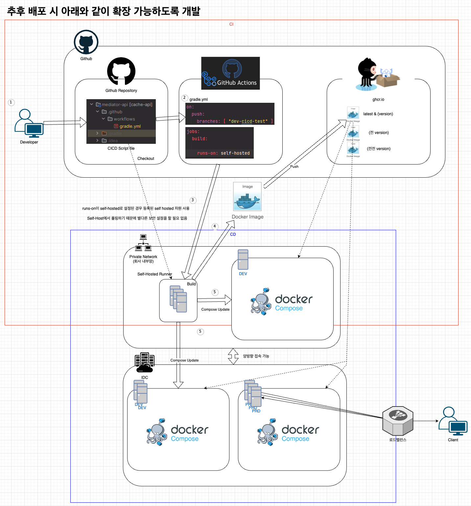
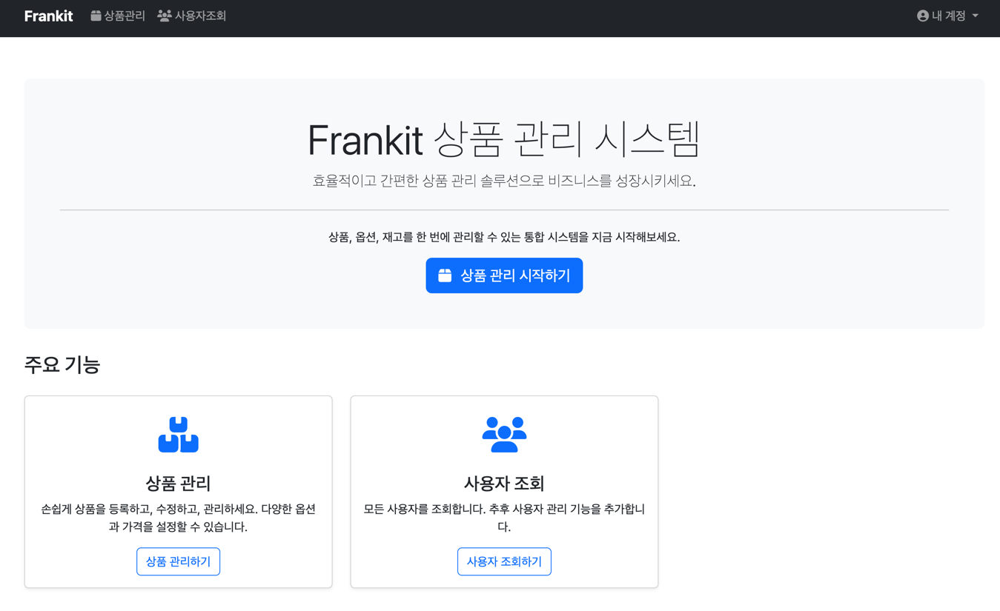
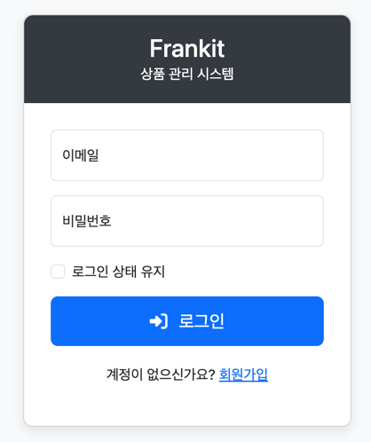
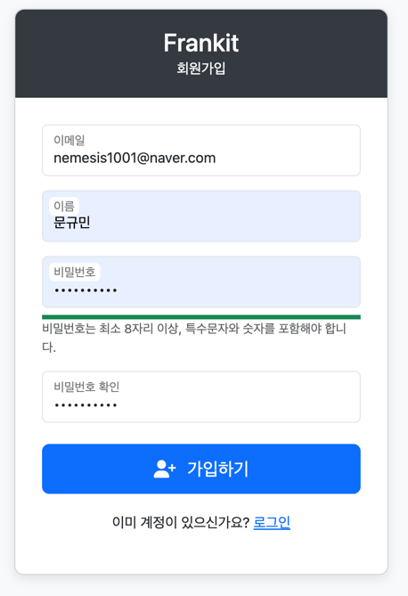
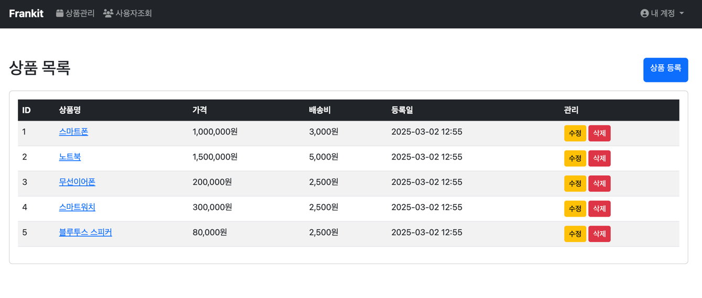
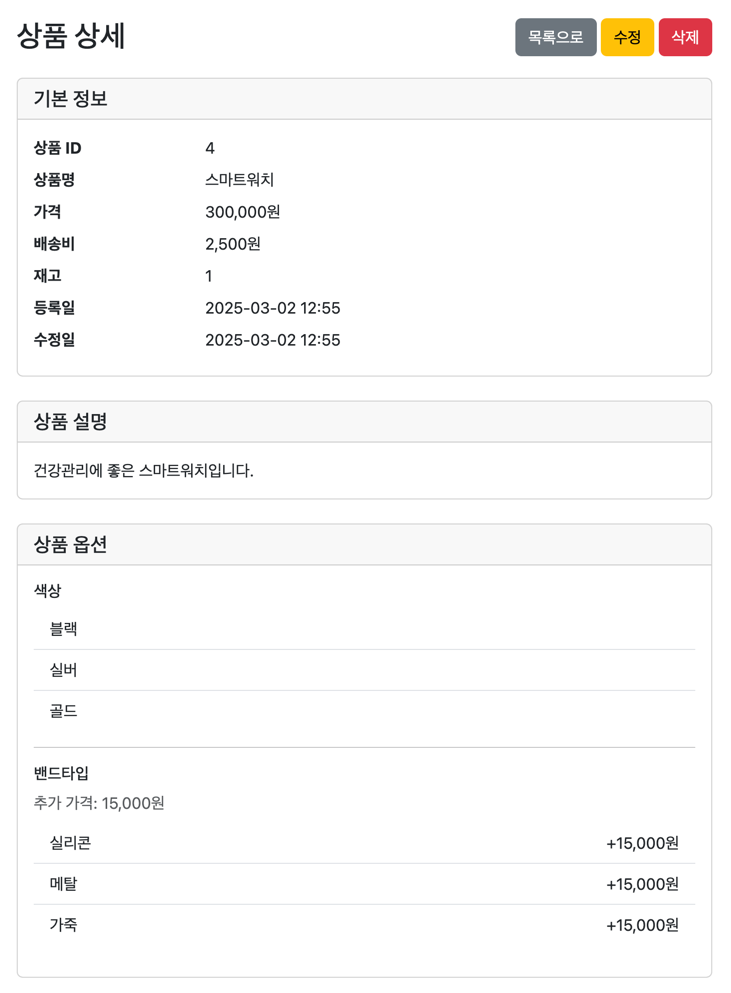
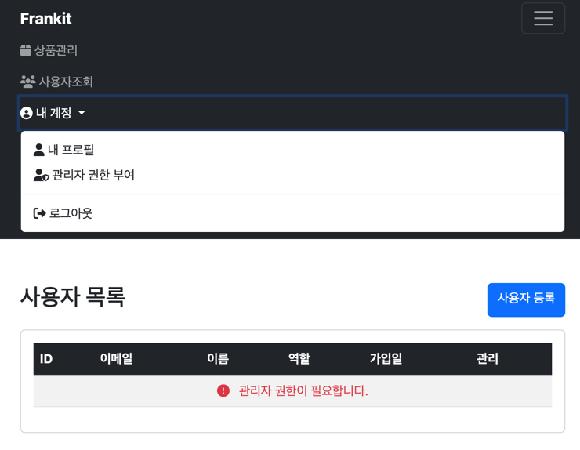
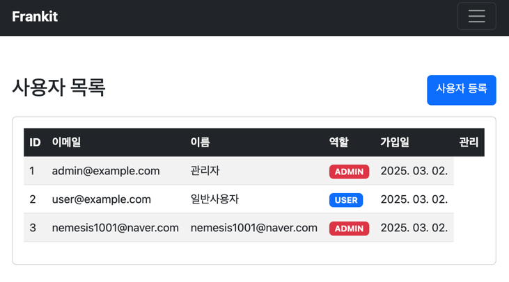
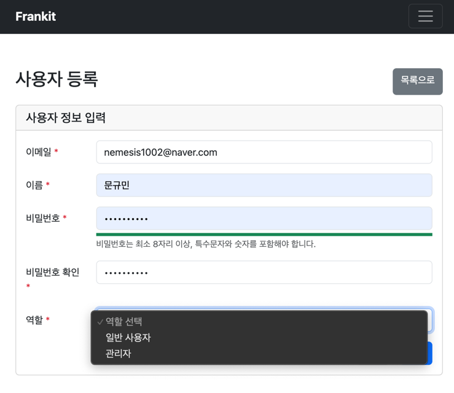
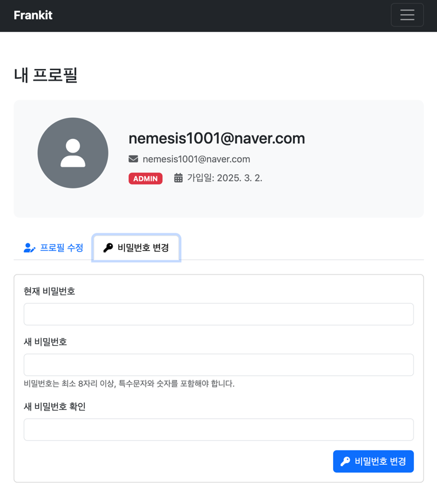

### `[문규민] - 프랜킷 과제`

# 상품 및 옵션 관리 API 아키텍처 설계 문서

## 1. 개요

프랜킷 과제 관련 API 아키텍처 정리. 
상품과 관련된 CRUD 기능과 함께 상품 옵션 관리 기능을 제공.

- 상품과 관련된 CRUD 기능을 구현하고, 상품 옵션 관리 기능을 포함한 RESTful API를 설계 및 개발.
- 완벽한 명세는 아니니, 고민의 여지가 있는 경우 자의적으로 해석하여 구현/구성하시면 됩니다.
- 요구사항 이외 추가 기능들을 자유롭게 구현/구성해도 무방합니다. 다만 제출 시 어필해 주셔야 평가 시 참고됩니다.

## 2. 기술 스택

- **Language**: Java 23
- **Framework**: Spring Boot 3.4.3
- **Build**: Gradle
- **Database**: MySQL 8.0, Redis 7.0
- **Container**: Docker(Podman), Docker(Podman) Compose
- **View**: Thymeleaf

### 2.1 DB 설계
성능상 필요한 경우 추후 인덱스를 걸어 쿼리 성능을 높힙니다. 

### users
```
+---------------+---------------+----------+
| 필드명        | 타입          | 제약조건  |
+---------------+---------------+----------+
| id            | BIGINT        | PK       |
| email         | VARCHAR       | NOT NULL, UNIQUE |
| password      | VARCHAR       | NOT NULL |
| name          | VARCHAR       | NOT NULL |
| role          | ENUM          | NOT NULL |
| created_at    | DATETIME      | NOT NULL |
| updated_at    | DATETIME      |          |
+---------------+---------------+----------+
```

### products
```
+---------------+---------------+----------+
| 필드명        | 타입          | 제약조건  |
+---------------+---------------+----------+
| id            | BIGINT        | PK       |
| name          | VARCHAR       | NOT NULL |
| description   | TEXT          |          |
| price         | DECIMAL       | NOT NULL |
| shipping_fee  | DECIMAL       | NOT NULL |
| stock         | BIGINT        | NOT NULL |
| created_by    | BIGINT        | NOT NULL |
| created_at    | DATETIME      | NOT NULL |
| last_modified_by | BIGINT     |          |
| updated_at    | DATETIME      |          |
+---------------+---------------+----------+
```

### product_options
```
+---------------+---------------+----------+
| 필드명        | 타입          | 제약조건  |
+---------------+---------------+----------+
| id            | BIGINT        | PK       |
| name          | VARCHAR       | NOT NULL |
| option_type   | ENUM          | NOT NULL |
| additional_price | DECIMAL    | NOT NULL |
| product_id    | BIGINT        | FK       |
| created_by    | BIGINT        | NOT NULL |
| created_at    | DATETIME      | NOT NULL |
| last_modified_by | BIGINT     |          |
| updated_at    | DATETIME      |          |
+---------------+---------------+----------+
```

### option_values
```
+---------------+---------------+----------+
| 필드명        | 타입          | 제약조건  |
+---------------+---------------+----------+
| id            | BIGINT        | PK       |
| value         | VARCHAR       | NOT NULL |
| product_option_id | BIGINT    | FK       |
| created_by    | BIGINT        | NOT NULL |
| created_at    | DATETIME      | NOT NULL |
| last_modified_by | BIGINT     |          |
| updated_at    | DATETIME      |          |
+---------------+---------------+----------+
```

## 관계 다이어그램

```
[users] ------ (로깅) ------> [BaseEntity]
                                  ^
                                  |
                                  | 상속
                                  |
[products] <----1:N------ [product_options] <----1:N------ [option_values]
```

## 열거형(Enum) 정보

1. **ProductOption.OptionType**:
  - INPUT("입력형")
  - SELECT("선택형")

2. **User.Role**:
  - USER
  - ADMIN

## 3. 아키텍처 개요

레이어드 아키텍처(Layered Architecture)를 적용하여 프로젝트를 진행했습니다.

### 3.1 계층 구조

```
클라이언트 <-> 프레젠테이션 계층 <-> 애플리케이션 계층 <-> 도메인 계층 <-> 인프라스트럭처 계층
```

- **프레젠테이션 계층 (Presentation Layer)**:
    - 외부 요청을 받아 처리하고 응답을 반환합니다.
    - 사용자 인터페이스와 시스템 간의 상호작용을 담당합니다.
    - HTTP 요청 검증, 응답 형식 변환, 예외 처리를 담당합니다.

- **애플리케이션 계층 (Application Layer)**:
    - 비즈니스 프로세스와 워크플로우를 조정합니다.
    - 트랜잭션 관리 및 여러 도메인 서비스 간의 조율을 담당합니다.
    - 도메인 객체를 조작하여 사용자의 의도를 실현합니다.

- **도메인 계층 (Domain Layer)**:
    - 핵심 비즈니스 로직과 규칙을 포함합니다.
    - 비즈니스 엔티티와 값 객체를 정의합니다.
    - 도메인 객체 간의 관계와 상호작용을 정의합니다.
    - 특정 기술이나 인프라스트럭처에 의존하지 않습니다.

- **인프라스트럭처 계층 (Infrastructure Layer)**:
    - 외부 시스템과의 통합 및 기술적 세부 사항을 구현합니다.
    - 데이터베이스, 메시징, 외부 API와의 통신을 담당합니다.
    - 도메인 계층에 정의된 인터페이스의 구체적인 구현을 제공합니다.
    - 공통 유틸리티와 보안, 로깅 등의 횡단 관심사를 처리합니다.

### 3.2 패키지 구조

```
com.tistory.kmmoon.frankit
├── FrankitAssignmentApplication.java
├── presentation/                      
│   ├── controller/                    
│   │   ├── api/                       
│   │   └── view/                      
│   ├── advice/                        
│   └── dto/                           
│       ├── request/                   
│       └── response/                  
├── application/                       
│   └── service/                       
├── domain/                            
│   ├── entity/                        
│   ├── repository/                    
│   ├── exception/                     
│   └── service/                       
├── infrastructure/                    
│   ├── config/                        
│   │   ├── security/                  
│   │   └── redis/                     
│   ├── repository/                    
│   ├── aspect/                        
│   └── util/                          
└── common/                            
    ├── annotation/                    
    └── constant/                      
```

### 3.3 주요 컴포넌트와 책임

#### Presentation 계층
- **API 컨트롤러**: REST API 엔드포인트를 제공하며, 요청을 검증하고 적절한 서비스 메서드를 호출합니다.
- **View 컨트롤러**: 웹 페이지 렌더링을 위한 컨트롤러입니다.
- **DTO**: 계층 간 데이터 전송을 위한 객체로, 요청 및 응답 형식을 정의합니다.
    - `request`: 클라이언트 요청 데이터 구조
    - `response`: API 응답 데이터 구조
- **Exception Handling**: API 오류 응답 형식을 표준화합니다.
    - `GlobalExceptionHandler`: 전역 예외 처리기

#### Application 계층
- **Service**: 비즈니스 프로세스를 구현하고 트랜잭션을 관리합니다.

#### Domain 계층
- **Entity**: 핵심 비즈니스 객체와 규칙을 구현합니다.
- **Repository**: 도메인 객체의 영속성 작업을 정의합니다.
- **Domain Exception**: 비즈니스 규칙 위반에 대한 예외를 정의합니다.

#### 인프라스트럭처 계층
- **Config**: 외부 시스템 연동 및 인프라 설정을 관리합니다.
- **Repository Impl**: 도메인 리포지토리 인터페이스의 구현을 제공합니다.
    - 필요한 경우 querydsl, jooq등 `UserRepositoryImpl`, `ProductRepositoryImpl` 등 커스텀 구현
- **Security**: 인증 및 권한 검사 관련 기능을 구현합니다.
- **Distributed**: 분산락 관련 기능을 구현합니다.

### 3.4 의존성 규칙

레이어드 아키텍처에서 가장 중요한 원칙은 의존성의 방향이 항상 외부 계층에서 내부 계층으로 향해야 한다는 것입니다.

```
프레젠테이션 -> 애플리케이션 -> 도메인 <- 인프라스트럭처
```

- 프레젠테이션 계층은 애플리케이션 계층에 의존합니다.
- 애플리케이션 계층은 도메인 계층에 의존합니다.
- 인프라스트럭처 계층은 도메인 계층에 의존합니다.
- 도메인 계층은 다른 어떤 계층에도 의존하지 않습니다.

이러한 의존성 규칙을 통해 핵심 비즈니스 로직을 보호하고, 기술적 변경에 따른 영향을 최소화할 수 있습니다. 또한 계층 간의 명확한 경계는 테스트 용이성과 유지보수성을 향상시킵니다.

### 3.5 분산락 아키텍처

분산 환경에서의 데이터 일관성을 위해 Redis 기반 분산락을 구현하였습니다:

- **선언적 락 적용**: `@DistributedLock` 어노테이션 사용
- **명령형 락 적용**: `DistributedLockTemplate` 유틸리티 클래스 사용
- **락 세분화 전략**: 리소스 유형 및 ID 기반 락 키 설계

이러한 구조를 통해 동시성 이슈를 효과적으로 제어하면서도 시스템의 확장성과 유연성을 유지할 수 있습니다.

## 4. 로깅 전략

local, dev, prod로 profile을 나눠 local, dev는 디버깅 시 편하게 디버깅 가능하도록, prod의 경우 로그가 너무 많이 쌓이지 않게 조정하여 WARN, ERROR 레벨의 에러를 traceid와 request 값을 함께 로그에 추가하여 에러가 발생 시, 로그를 보고 찾아갈수 있도록 조치합니다.
현업이라면 ELK의 ElasticAPM + Kibana, Datadog, Grafana 등을 사용해 모니터링 하겠지만 해당 부분은 시간상 구현이 불가능해 제외하였습니다.
Actuator나 Spring Boot Admin를 사용하여 실행중인 로그 레벨을 바꾸는 것도 가능하므로 로깅 레벨을 적절히 바꿔 로깅하는것도 고려할 수 있습니다.

### 4.1 profile 별 검토 사항
profile이 dev, prod 환경이라면 에러 로그를 logback을 사용해 slack과 같은 메신저로 웹훅을 통해 알람을 보내겠지만, 해당 부분은 검토하지 않았습니다.
또한, 롤링 규칙이나 운영 시 로그 관리 부분, 민감한 정보에 대한 마스킹 처리도 빠져있습니다.
시간 관계상 exception에 따른 에러 로깅을 상세화하여 에러가 발생한 구체적 원인, 요청 파라미터 등도 간략하게 설정했습니다.


## 5. 수행 시 가산점 수행 항목
### 5.1 주요 서비스 흐름에 따른 에러처리 및 로깅

디버깅에 필요한 로그를 남기려 최대한 노력했고, ExceptionHandler를 통해 특정 에러가 발생 시, 각각 필요한 로그가 남도록 노력했습니다.

### 5.2 유닛 테스트

슬라이스 테스트 전부를 수행한 것은 아니나, 기능상 필요한 서비스 단의 테스트, AuthController 관련 테스트, Security 관련 테스트를 수행했습니다.

### 5.3 확장 가능한 코드 구성 또는 서버 아키텍쳐 구성 (간단한 설계 문서 제출 필요)

스케일아웃하여 확장 가능하도록 Docker로 이미지화 하여 관리 가능하도록 개발하였습니다. alpine 이미지를 활용해 이미지를 다이어트 시켰으며, 동시성 이슈가 발생할 경우를 대비하여 싱글스레드 특성을 가진 Redis를 활용해 Redission 분산 락을 구현했습니다. 이후 추가될 환경들을 대비해 profile 환경을 분리해 환경이 추가되어도 프로퍼티만 바뀌면 실행 가능하도록 개발했으며, .env 파일을 추가해 이미지 밖에서 데이터를 받을 수 있도록 고려하여 개발했습니다. 


### 5.4 사용할 수 있는 간단한 View 만들기(실행법 포함)

#### 1. spring boot를 구동합니다.
필요한 포트(mysql 3306, redis 6379, tomcat 8080)
실행 시 compose 파일이 존재하므로 자동으로 실행되지만, 실행되지 않을 시 해당 compose 파일을 실행해줘야 합니다.

#### 2. 홈페이지 주소 접속
http://localhost:8080/api/home
우측 상단의 로그인 버튼을 눌러 로그인 화면으로 진입 > 회원가입 버튼을 회원가입 진행 후 로그인 합니다. 

앞에 api가 붙은 이유는 server.servlet.context-path: /api 설정 때문이며, 실무에선 당연히 멀티모듈로 분리하여 개발하겠지만 간단히 확인 가능한 용도로 개발한 것이므로 양해 부탁드립니다.
우측




#### 3. 상품 관리 화면(수정, 삭제, 등록)

1. 수정 및 삭제는 본인이나 ADMIN 권한을 가진 유저만 삭제할 수 있습니다.
2. 상품 옵션은 최대 3개까지 추가 가능합니다.
3. 옵션의 경우 선택형, 텍스트형 두 가지가 존재하며, 선택형의 경우 상품 옵션 값을 하위로 최대 10개까지 추가 가능합니다.

예를들어 선택형의 경우 옵션을 선택형 색상 > [그레이, 실버, 블루, 레드]와 같이 여러 옵션이 필요한 경우 적절합니다.



#### 4. 사용자 목록 조회
사용자 관리 기능까지 넣고자 했으나 어머니 수술로 인해 시간이 부족해져 해당 부분을 제외했습니다.

1. 사용자 목록은 관리자 권한이 필요하며, 편의 기능으로 상단에 관리자 권한 부여 기능을 추가해놨습니다. 권한을 부여한 후 새로고침하면 리스트가 보여지는 형태입니다.




2. 일반 사용자, 관리자 권한을 가진 사용자를 생성 가능합니다.



#### 5. 내 프로필 조회
내 정보를 조회하거나, 비밀번호를 수정 가능합니다.

